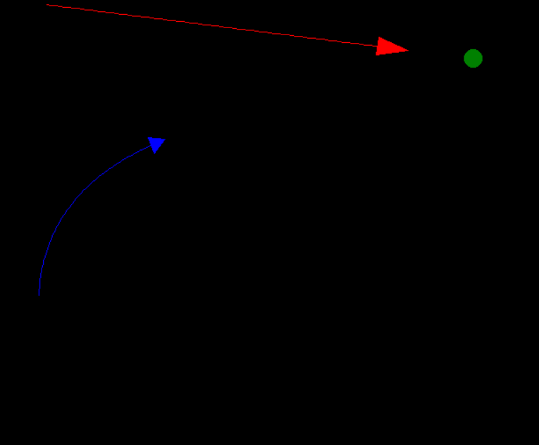
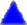

# *Miss*-ile

(get it? miss? missile? miss-il)

## thingamajigs

- missile 
- enemy 
- target 

## guidance types

| object  | type       | description                                 | progress | effectiveness |
| ------- | ---------- | ------------------------------------------- | -------- | ------------- |
| missile | direct     | go to nearest target                        | 100% 👍  | ~75% ✅      |
| missile | avoidance  | go to nearest target avoiding obstacles     | [V2](https://github.com/snqwq/Missile/tree/2.X.X) 🌿  | ??% ❓       |
| enemy   | direct     | go to nearest missile                       | 100% 👍  | ~50% ➖      |
| enemy   | predictive | go to where the nearest missile will be     | [V2](https://github.com/snqwq/Missile/tree/2.X.X) 🌿  | ??% ❓       |
| enemy   | defensive  | go to the missile closest to nearest target | [V2](https://github.com/snqwq/Missile/tree/2.X.X) 🌿  | ??% ❓       |
| target  | static     | dont move (pretty simple)                   | 100% 👍  | ~0% ❌       |

## [Version 2](https://github.com/snqwq/Missile/tree/2.X.X)

### Changes

- Improved graphics
- Additional guidance types
- Bug fixes
- More efficient code
- More accurate simulation
- General improvements
- More documentation
